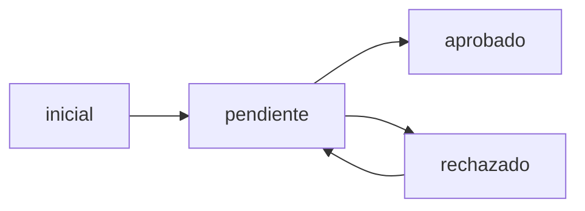

# Database Schema — GeoAPIs

Documentación técnica del esquema de base de datos para el sistema de gestión de infraestructura geoespacial.

---

## Visión General

GeoAPIs utiliza PostgreSQL con la extensión PostGIS para gestionar datos geoespaciales de la red de fibra óptica. Todas las entidades heredan de una clase base común y almacenan propiedades específicas en campos JSONB.

### Tecnologías

- **PostgreSQL** 14+ - Sistema de gestión de base de datos relacional
- **PostGIS** 3.0+ - Extensión espacial para tipos geométricos y funciones GIS
- **SQLAlchemy** - ORM para Python
- **GeoAlchemy2** - Extensión SQLAlchemy para tipos geométricos

---

## Arquitectura de Tablas

### Clase Base: `BaseFeaturesTable`

Todas las entidades del sistema heredan de esta clase base que proporciona campos comunes de auditoría y control:

```python
class BaseFeaturesTable:
    id = Column(Integer, primary_key=True)
    propiedades = Column(JSONB)
    geom = Column(Geometry)  # POINT o LINESTRING según la entidad
    created_at = Column(DateTime(timezone=True), server_default=func.now())
    updated_at = Column(DateTime(timezone=True), server_default=func.now(), onupdate=func.now())
    created_by = Column(String)
    updated_by = Column(String)
    estado = Column(Enum(EstadoRegistro), default=EstadoRegistro.PENDIENTE)
    is_initial_load = Column(Boolean, default=False)
```

#### Campos Comunes

| Campo | Tipo | Descripción | Valores |
| ----- | ---- | ----------- | ------- |
| `id` | Integer | Identificador único autoincremental | 1, 2, 3... |
| `propiedades` | JSONB | Propiedades específicas del tipo de elemento | Ver sección por entidad |
| `geom` | Geometry | Geometría espacial (SRID 4326 - WGS84) | POINT o LINESTRING |
| `created_at` | DateTime | Fecha/hora de creación (UTC) | ISO 8601 |
| `updated_at` | DateTime | Fecha/hora de última actualización (UTC) | ISO 8601 |
| `created_by` | String | Usuario que creó el registro | username |
| `updated_by` | String | Usuario que actualizó por última vez | username |
| `estado` | Enum | Estado del registro | inicial, pendiente, aprobado, rechazado |
| `is_initial_load` | Boolean | Indica si es parte de carga inicial | true/false |

---

## Sistema de Estados

Los registros pasan por un flujo de aprobación:



| Estado | Descripción | Asignado Por | Transiciones Permitidas |
| ------ | ----------- | ------------ | ----------------------- |
| **inicial** | Carga inicial del sistema (datos históricos) | Sistema automático | → pendiente |
| **pendiente** | Registro nuevo esperando aprobación | Sistema (al crear) | → aprobado, rechazado |
| **aprobado** | Registro validado y aprobado | Supervisor/Admin | (final) |
| **rechazado** | Registro rechazado, requiere corrección | Supervisor/Admin | → pendiente |

---

## Entidades del Sistema

### 1. Cámaras (`camaras`)

**Propósito**: Cámaras de inspección subterráneas (manholes) que permiten el acceso a la infraestructura de cables de fibra óptica.

**Geometría**: `POINT`

**Propiedades JSONB**:

| Propiedad | Tipo | Descripción | Ejemplo | Requerido |
| --------- | ---- | ----------- | ------- | --------- |
| `type` | String | Tipo de cámara | "Subterranea" | No |
| `nombre_esp` | String | Nombre español descriptivo | "CAM-CENTRO-01" | No |
| `apertura` | String | Tipo de apertura | "ESTANDAR", "MAGNETICA", "LLAVE DE SEGURIDAD" | No |
| `ubicacion` | String | Dirección física | "Calle 100 # 15-20" | No |
| `propietari` | String | Propietario de la cámara | "ETB", "CODENSA", "SDM" | No |
| `estado_cam` | String | Estado de la cámara | "SIN NOVEDAD", "CON GASES" | No |
| `estado_tapa` | String | Estado de la tapa | "Buena", "En daño", "Sin tapa" | No |
| `codigo_etb` | String | Código ETB único | "ETB-12345" | No |
| `marquillado` | String | Indica si está marquillada | "SÍ", "NO" | No |
| `id_texto` | String | Identificador de texto | "CAM-001" | No |
| `constructi` | String | Estado de construcción | - | No |
| `observaciones` | String | Observaciones adicionales | "Requiere mantenimiento" | No |
| `remedy_id` | String | ID de tarea REMEDY | "INC000012345" | No |
| `tecnico` | String | Técnico responsable | "Juan Pérez" | No |

**Valores Válidos - Apertura**:
- `ESTANDAR`
- `MAGNETICA`
- `ESTANDAR SOLDADA`
- `LLAVE DE SEGURIDAD`
- `CORCHO DIFERENCIAL`
- `CORTINA - CANDADO`
- `Llave de Seguridad - SOLDADA`
- `CORCHO GRUA`

**Valores Válidos - Propietario**:
- `ETB`
- `CODENSA`
- `OTROS OPERADORES`
- `SDM`
- `SMV`
- `EMSA`

**Valores Válidos - Estado Tapa**:
- `Buena`
- `En daño`
- `Sin seguridad`
- `Sin tapa`

**Índices**:
- `PRIMARY KEY (id)`
- `GIST INDEX ON (geom::geography)` - Para consultas espaciales eficientes

---

### 2. Empalmes (`empalmes`)

**Propósito**: Puntos de conexión/empalme entre cables de fibra óptica. Pueden ser mecánicos o por fusión.

**Geometría**: `POINT`

**Propiedades JSONB**:

| Propiedad | Tipo | Descripción | Ejemplo | Requerido |
| --------- | ---- | ----------- | ------- | --------- |
| `name` | String | Etiqueta cable/marquilla | "EMP-001" | No |
| `type` | String | Tipo de empalme | "Mecánico", "Fusión" | No |
| `tipo_empalme` | String | Configuración del empalme | "T-T", "T-A", "A-A" | No |
| `cable1` | String | Cable 1 conectado | "CABLE-001" | No |
| `cable2` | String | Cable 2 conectado | "CABLE-002" | No |
| `id_texto` | String | Identificador de texto | "EMP-001" | No |
| `propietario` | String | Propietario | "ETB" | No |
| `splice_type` | String | Tipo de splice | - | No |
| `construction_status` | String | Estado de construcción | - | No |
| `observaciones` | String | Observaciones | "Empalme nuevo" | No |
| `remedy_id` | String | ID tarea REMEDY | "INC000012345" | No |
| `tecnico` | String | Técnico responsable | "Juan Pérez" | No |

**Valores Válidos - Tipo Empalme**:
- `T-T` - Tierra-Tierra
- `T-A` - Tierra-Aéreo
- `A-A` - Aéreo-Aéreo

**Índices**:
- `PRIMARY KEY (id)`
- `GIST INDEX ON (geom::geography)`
- `UNIQUE ON propiedades->>'id_texto'` (cuando existe)

---

### 3. Cables Corporativos (`cable_corporativo`)

**Propósito**: Cables de fibra óptica que forman la red troncal y de acceso.

**Geometría**: `LINESTRING`

**Propiedades JSONB**:

| Propiedad | Tipo | Descripción | Ejemplo | Requerido |
| --------- | ---- | ----------- | ------- | --------- |
| `id_text` | String | ID de texto (NOTA: no `id_texto`) | "CABLE-001" | No |
| `name` | String | Nombre del cable | "Cable Principal Norte" | No |
| `nombre_esp` | String | Nombre español | "Ductado 24h senc" | No |
| `nombre_ant` | String | Nombre anterior | - | No |
| `colocacion` | String | Tipo de colocación | "Troncal", "Acceso", "Troncal-Acceso" | No |
| `constructi` | String | Estado de construcción | - | No |
| `perdida_db` | String | Pérdida en dB | "0.5" | No |
| `contratist` | String | Contratista | "Empresa XYZ" | No |
| `segmento` | String | Segmento de red | - | No |
| `pr` | String | PR | - | No |
| `calculat1` | String | Campo calculado 1 | - | No |
| `calculat2` | String | Campo calculado 2 | - | No |
| `calculated` | String | Campo calculado | - | No |
| `id_especif` | String | ID especificación | - | No |
| `measured_l` | String | Longitud medida | - | No |
| `observaciones` | String | Observaciones | "Cable nuevo instalado" | No |
| `remedy_id` | String | ID tarea REMEDY | "INC000012345" | No |
| `tecnico` | String | Técnico responsable | "Juan Pérez" | No |

**Nota Importante**: Los cables usan `id_text` en lugar de `id_texto` (diferente a otras entidades).

**Campos Calculados**:
- Longitud en metros: `ST_Length(geom::geography)`
- Coordenadas inicio: `ST_StartPoint(geom)`
- Coordenadas fin: `ST_EndPoint(geom)`

**Índices**:
- `PRIMARY KEY (id)`
- `GIST INDEX ON (geom::geography)`

---

### 4. Reportes de Mal Estado (`reportes_mal_estado`)

**Propósito**: Registros de infraestructura en mal estado que requiere mantenimiento o reparación.

**Geometría**: `POINT`

**Propiedades JSONB**:

| Propiedad | Tipo | Descripción | Ejemplo | Requerido |
| --------- | ---- | ----------- | ------- | --------- |
| `numero_cable` | String | Número del cable afectado | "CABLE-001" | No |
| `nivel_dano` | String | Nivel de daño | "Alto", "Medio", "Bajo" | No |
| `direccion` | String | Dirección del reporte | "Calle 80 # 30-40" | No |
| `observaciones` | String | Descripción del problema | "Caja rota con cables expuestos" | No |
| `remedy_id` | String | ID tarea REMEDY | "INC000012345" | No |
| `tecnico` | String | Técnico que reporta | "Juan Pérez" | No |

**Valores Válidos - Nivel de Daño**:
- `Alto` - Requiere atención inmediata
- `Medio` - Requiere planificación de reparación
- `Bajo` - Mantenimiento preventivo

**Índices**:
- `PRIMARY KEY (id)`
- `GIST INDEX ON (geom::geography)`

**Nota Importante**: Esta tabla requirió una migración de esquema el 2026-02-20 para agregar columnas faltantes de `BaseFeaturesTable` (`created_at`, `updated_at`, `estado`, `created_by`, `updated_by`, `is_initial_load`). Ver `sql/fix_reportes_mal_estado_schema.sql` para detalles.

---

### 5. Centrales (`centrales`)

**Propósito**: Centrales de telecomunicaciones y nodos principales de la red.

**Geometría**: `POINT`

**Estado**: Sin formulario de registro en frontend actual. Datos gestionados por carga masiva o API directa.

**Índices**:
- `PRIMARY KEY (id)`
- `GIST INDEX ON (geom::geography)`

---

### 6. Reservas (`reservas`)

**Propósito**: Reservas de infraestructura de red para proyectos futuros.

**Geometría**: `POINT`

**Estado**: Sin formulario de registro en frontend actual. Datos gestionados por carga masiva o API directa.

**Índices**:
- `PRIMARY KEY (id)`
- `GIST INDEX ON (geom::geography)`

---

## Sistema de Coordenadas

- **SRID**: 4326 (WGS84)
- **Formato**: Grados decimales
- **Orden**: `[longitud, latitud]`
- **Rango válido**:
  - Longitud: -180 a 180
  - Latitud: -90 a 90

### Ejemplo de Geometrías

**POINT (Cámara, Empalme, Reporte)**:
```sql
POINT(-74.0817 4.6097)
```

**LINESTRING (Cable)**:
```sql
LINESTRING(-74.0817 4.6097, -74.0845 4.6125, -74.0873 4.6153)
```

---

## Índices Espaciales

Todos las tablas geoespaciales tienen índices GIST para optimizar consultas espaciales:

```sql
CREATE INDEX IF NOT EXISTS idx_camaras_geom_geog
ON camaras USING GIST ((geom::geography));

CREATE INDEX IF NOT EXISTS idx_empalmes_geom_geog
ON empalmes USING GIST ((geom::geography));

CREATE INDEX IF NOT EXISTS idx_cable_corporativo_geom_geog
ON cable_corporativo USING GIST ((geom::geography));

CREATE INDEX IF NOT EXISTS idx_reportes_mal_estado_geom_geog
ON reportes_mal_estado USING GIST ((geom::geography));
```

Estos índices se crean automáticamente en el evento `startup` de la aplicación FastAPI.

---

## Funciones PostGIS Personalizadas

### `fn_nodos_alcanzables_en_ruta_red`

Encuentra nodos alcanzables en la red dentro de una distancia específica.

**Parámetros**:
- `longitud` - Longitud del punto de origen
- `latitud` - Latitud del punto de origen
- `distancia_metros` - Radio de búsqueda en metros

**Retorna**: Conjunto de nodos alcanzables con sus rutas.

**Ubicación**: `sql/fn_nodos_alcanzables_en_ruta_red.sql`

**Nota**: Esta función debe desplegarse manualmente; no es ejecutada automáticamente por `setup.py`.

---

## Triggers

### `update_updated_at_column`

Actualiza automáticamente el campo `updated_at` cuando se modifica un registro.

**Aplicado a**:
- `camaras`
- `empalmes`
- `cable_corporativo`
- `reportes_mal_estado`
- `centrales`
- `reservas`

**Creación**:
```sql
CREATE OR REPLACE FUNCTION update_updated_at_column()
RETURNS TRIGGER AS $$
BEGIN
    NEW.updated_at = NOW();
    RETURN NEW;
END;
$$ LANGUAGE plpgsql;

CREATE TRIGGER update_camaras_updated_at
    BEFORE UPDATE ON camaras
    FOR EACH ROW
    EXECUTE FUNCTION update_updated_at_column();
```

**Archivo**: `sql/create_trigger_updated_at.sql`

---

## Secuencias

Cada tabla tiene una secuencia asociada para generar IDs autoincrementales:

- `camaras_id_seq`
- `empalmes_id_seq`
- `cable_corporativo_id_seq`
- `reportes_mal_estado_id_seq`
- `centrales_id_seq`
- `reservas_id_seq`

### Reseteo de Secuencias

Después de cargas masivas o migraciones, las secuencias pueden desincronizarse. Ver [Manejo de Secuencias](manejo-secuencias.md) para más información.

---

## Convenciones de Nombres

### Propiedades JSONB

⚠️ **Importante**: Existen inconsistencias en nombres de propiedades JSONB entre entidades:

| Entidad | Propiedad ID | Propiedad Tipo | Razón |
| ------- | ------------ | -------------- | ----- |
| **Cámaras** | `id_texto` | `type` | Estándar del sistema |
| **Empalmes** | `id_texto` | `type` | Estándar del sistema |
| **Cables** | `id_text` ⚠️ | `name` | Herencia de sistema legacy |
| **Reportes** | - | - | No aplica |

**Recomendación**: Mantener estas convenciones en código existente por compatibilidad. Para nuevas entidades, usar `id_texto` y `type`.

---

## Validación de Datos

### A Nivel de Base de Datos

- **NOT NULL**: Campos `id`, `geom`, `estado`, `created_at`, `updated_at`
- **UNIQUE**: `propiedades->>'id_texto'` cuando se proporciona (solo empalmes)
- **CHECK**: Sistema de coordenadas válido (SRID 4326)

### A Nivel de Aplicación

- **Validación Pydantic**: Modelos en `app/routes/api_models.py`
- **Validación de Geometría**: WKT válido o coordenadas lat/lon válidas
- **Validación de Valores**: Enums para estados, tipos, etc.

---

## Migrations y Versionamiento

El esquema se gestiona mediante SQLAlchemy ORM con creación automática de tablas:

```python
# app/db_init.py
from app.models import Base
Base.metadata.create_all(bind=engine)
```

**Consideraciones**:
- No se utiliza Alembic actualmente
- Los cambios de esquema se realizan mediante modificación directa de `app/models.py`
- Backup de datos recomendado antes de cambios de esquema

---

## Backup y Recuperación

### Backup Completo

```bash
pg_dump -h $DB_HOST -p $DB_PORT -U $DB_USER -d $DB_NAME -F c -b -v -f backup_geoapis_$(date +%Y%m%d).backup
```

### Backup Solo Datos

```bash
pg_dump -h $DB_HOST -p $DB_PORT -U $DB_USER -d $DB_NAME --data-only -F c -b -v -f data_geoapis_$(date +%Y%m%d).backup
```

### Restauración

```bash
pg_restore -h $DB_HOST -p $DB_PORT -U $DB_USER -d $DB_NAME -v backup_geoapis_YYYYMMDD.backup
```

---

## Performance Considerations

### Consultas Espaciales Optimizadas

✅ **Usar geography cast para consultas de distancia**:
```sql
ST_DWithin(geom::geography, punto::geography, radio_metros)
```

❌ **Evitar sin geography cast** (usa grados, no metros):
```sql
ST_DWithin(geom, punto, radio_grados)  -- ❌ Incorrecto
```

### Límites de Timeout

- Statement timeout configurado: **15 segundos**
- Connection pool: **2-10 conexiones**
- Recomendación: Paginar resultados para consultas grandes

---

## Referencias

- [PostgreSQL Documentation](https://www.postgresql.org/docs/)
- [PostGIS Documentation](https://postgis.net/docs/)
- [SQLAlchemy Documentation](https://docs.sqlalchemy.org/)
- [GeoAlchemy2 Documentation](https://geoalchemy-2.readthedocs.io/)
